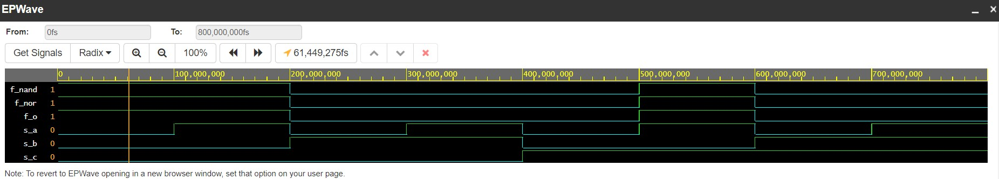
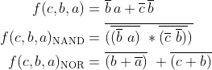

# Digital-electronics-1

## Laboratoře (Gates)
### 1.
Odkaz na můj [GitHub](https://github.com/xkrych01/Digital-electronics-1)

### 2.
**Zdrojový kód**

```
entity gates is
	port
    (
    	a_i : in std_logic;
        b_i : in std_logic;
        c_i : in std_logic;
        f_i : out std_logic;
        fnand_i : out std_logic;
        fnor_i : out std_logic
    );
end entity gates;


architecture dataflow of gates is 
begin 
	 f_i <= ((not b_i) and a_i) or ((not c_i) and (not b_i));
     fnand_i <= not ((not ((not b_i) and a_i)) and (not((not c_i) and (not b_i))));
     fnor_i <= not (b_i or (not a_i)) or (not (c_i or b_i));
     
end architecture dataflow;

```


**Screenshot simulace De-Morganových zákonů a upravené vzorce**



**Tabulka zjištěných hodnot ze simulace**
| **c** | **b** |**a** | **f(c,b,a)** |
| :-: | :-: | :-: | :-: |
| 0 | 0 | 0 | 1 |
| 0 | 0 | 1 | 1 |
| 0 | 1 | 0 | 0 |
| 0 | 1 | 1 | 0 |
| 1 | 0 | 0 | 0 |
| 1 | 0 | 1 | 1 |
| 1 | 1 | 0 | 0 |
| 1 | 1 | 1 | 0 |


**Odkaz na EDA Playground**
[Zde](https://www.edaplayground.com/x/FiDd) najdete naprogramovanou simulaci.


