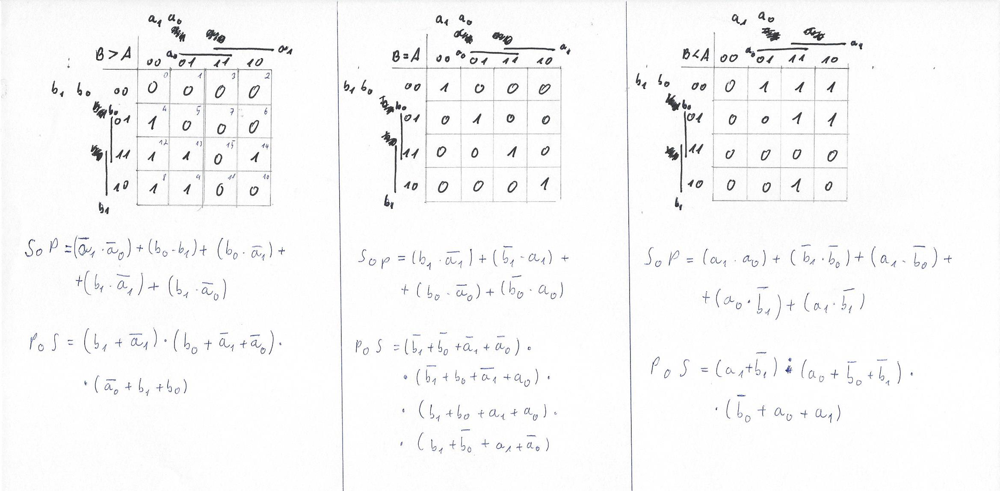
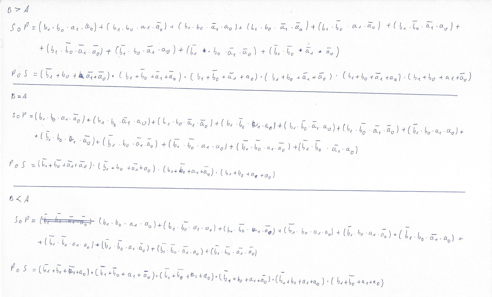

# Lab 02

## Tabulka hodnot

| **Dec. equivalent** | **B[1] B[0]** | **A[1] A[0]** | **B > A** | **B = A** | **B < A** |
| :-: | :-: | :-: | :-: | :-: | :-: |
| 0 | 0  0 | 0  0 | 0 | 1 | 0 |
| 1 | 0  0 | 0  1 | 0 | 0 | 1 |
| 2 | 0  0 | 1  0 | 0 | 0 | 1 |
| 3 | 0  0 | 1  1 | 0 | 0 | 1 |
| 4 | 0  1 | 0  0 | 1 | 0 | 0 |
| 5 | 0  1 | 0  1 | 0 | 1 | 0 |
| 6 | 0  1 | 1  0 | 0 | 0 | 1 |
| 7 | 0  1 | 1  1 | 0 | 0 | 1 |
| 8 | 1  0 | 0  0 | 1 | 0 | 0 |
| 9 | 1  0 | 0  1 | 1 | 0 | 0 |
| 10 | 1  0 | 1  0 | 0 | 1 | 0 |
| 11 | 1  0 | 1  1 | 0 | 0 | 1 |
| 12 | 1  1 | 0  0 | 1 | 0 | 0 |
| 13 | 1  1 | 0  1 | 1 | 0 | 0 |
| 14 | 1  1 | 1  0 | 1 | 0 | 0 |
| 15 | 1  1 | 1  1 | 0 | 1 | 0 |


## 0.2 bit K-mapy a logické fce





## Syntaxe 

### Složení kódu v design.vhd
```
entity comparator_4bit is
    port(
        a_i           : in  std_logic_vector(4 - 1 downto 0);
        b_i           : in  std_logic_vector(4 - 1 downto 0);

        B_vetsi_A_o : out std_logic;
        B_rovno_A_o  : out std_logic;
        B_mensi_A_o    : out std_logic      
    );
end entity comparator_4bit;

architecture Behavioral of comparator_4bit is
begin

    B_vetsi_A_o  <= '1' when (b_i > a_i) else '0';
    B_rovno_A_o   <= '1' when (b_i = a_i) else '0';
    B_mensi_A_o     <= '1' when (b_i < a_i) else '0';

end architecture Behavioral;
```


### Složení kódu v testbench.vhd
```
entity tb_comparator_4bit is

end entity tb_comparator_4bit;

architecture testbench of tb_comparator_4bit is

    signal s_a       : std_logic_vector(4 - 1 downto 0);
    signal s_b       : std_logic_vector(4 - 1 downto 0);
    signal s_B_vetsi_A : std_logic;
    signal s_B_rovno_A  : std_logic;
    signal s_B_mensi_A    : std_logic;

begin

    uut_comparator_4bit : entity work.comparator_4bit
        port map(
            a_i           => s_a,
            b_i           => s_b,
            B_vetsi_A_o => s_B_vetsi_A,
            B_rovno_A_o  => s_B_rovno_A,
            B_mensi_A_o    => s_B_mensi_A
        );

    p_stimulus : process
    begin
        
        report "Stimulus process started" severity note;

        s_b <= "0000"; s_a <= "0000"; 
        wait for 100 ns;
        assert ((s_B_vetsi_A = '0') and (s_B_rovno_A = '1') and (s_B_mensi_A = '0'))
        report "Chyba pro vstupní kombinaci: 0000, 0000" severity error;
        
        s_b <= "0100"; s_a <= "0001"; 
        wait for 100 ns;
        assert ((s_B_vetsi_A = '1') and (s_B_rovno_A = '1') and (s_B_mensi_A = '0'))
        report "Chyba pro vstupní kombinaci: 0100, 0001" severity error;
       
        s_b <= "0100"; s_a <= "0010"; 
        wait for 100 ns;
        assert ((s_B_vetsi_A = '1') and (s_B_rovno_A = '0') and (s_B_mensi_A = '0'))
        report "Chyba pro vstupní kombinaci: 0100, 0010" severity error;
        
        s_b <= "0100"; s_a <= "0011"; 
        wait for 100 ns;
        assert ((s_B_vetsi_A = '1') and (s_B_rovno_A = '0') and (s_B_mensi_A = '1'))
        report "Chyba pro vstupní kombinaci: 0100, 0011" severity error;

		s_b <= "0101"; s_a <= "0100"; 
        wait for 100 ns;
        assert ((s_B_vetsi_A = '0') and (s_B_rovno_A = '0') and (s_B_mensi_A = '0'))
        report "Chyba pro vstupní kombinaci: 0101, 0100" severity error;
        
        s_b <= "0101"; s_a <= "0101"; 
        wait for 100 ns;
        assert ((s_B_vetsi_A = '0') and (s_B_rovno_A = '1') and (s_B_mensi_A = '0'))
        report "Chyba pro vstupní kombinaci: 0101, 0101" severity error;
        
        s_b <= "0101"; s_a <= "0110"; 
        wait for 100 ns;
        assert ((s_B_vetsi_A = '0') and (s_B_rovno_A = '0') and (s_B_mensi_A = '1'))
        report "Chyba pro vstupní kombinaci: 0101, 0110" severity error;
        
        s_b <= "0101"; s_a <= "0111"; 
        wait for 100 ns;
        assert ((s_B_vetsi_A = '0') and (s_B_rovno_A = '0') and (s_B_mensi_A = '1'))
        report "Chyba pro vstupní kombinaci: 0101, 0111" severity error;
        
        s_b <= "1110"; s_a <= "0100"; 
        wait for 100 ns;
        assert ((s_B_vetsi_A = '1') and (s_B_rovno_A = '0') and (s_B_mensi_A = '0'))
        report "Chyba pro vstupní kombinaci: 1110, 0100" severity error;
        
        s_b <= "1110"; s_a <= "0101"; 
        wait for 100 ns;
        assert ((s_B_vetsi_A = '1') and (s_B_rovno_A = '0') and (s_B_mensi_A = '0'))
        report "Chyba pro vstupní kombinaci: 1110, 0101" severity error;
        
        s_b <= "1110"; s_a <= "0110"; 
        wait for 100 ns;
        assert ((s_B_vetsi_A = '1') and (s_B_rovno_A = '0') and (s_B_mensi_A = '0'))
        report "Chyba pro vstupní kombinaci: 1110, 0110" severity error;
        
         s_b <= "1110"; s_a <= "0111"; 
        wait for 100 ns;
        assert ((s_B_vetsi_A = '1') and (s_B_rovno_A = '0') and (s_B_mensi_A = '0'))
        report "Chyba pro vstupní kombinaci: 1110, 0111" severity error;
        
        s_b <= "1111"; s_a <= "0100"; 
        wait for 100 ns;
        assert ((s_B_vetsi_A = '1') and (s_B_rovno_A = '0') and (s_B_mensi_A = '0'))
        report "Chyba pro vstupní kombinaci: 1111, 0100" severity error;
        
        s_b <= "1111"; s_a <= "1101"; 
        wait for 100 ns;
        assert ((s_B_vetsi_A = '1') and (s_B_rovno_A = '0') and (s_B_mensi_A = '0'))
        report "Chyba pro vstupní kombinaci: 1111, 1101" severity error;
        
        s_b <= "1111"; s_a <= "1110"; 
        wait for 100 ns;
        assert ((s_B_vetsi_A = '1') and (s_B_rovno_A = '0') and (s_B_mensi_A = '0'))
        report "Chyba pro vstupní kombinaci: 1111, 1110" severity error;
        
        s_b <= "1111"; s_a <= "1111"; 
        wait for 100 ns;
        assert ((s_B_vetsi_A = '0') and (s_B_rovno_A = '1') and (s_B_mensi_A = '0'))
        report "Chyba pro vstupní kombinaci: 1111, 1111" severity error;

        report "Stimulus process finished" severity note;
        wait;
    end process p_stimulus;

end architecture testbench;

```

### Log
```
analyze design.vhd
analyze testbench.vhd
elaborate tb_comparator_4bit
testbench.vhd:34:9:@0ms:(report note): Stimulus process started
testbench.vhd:45:9:@200ns:(assertion error): Chyba pro vstupní kombinaci: 0100, 0001
testbench.vhd:55:9:@400ns:(assertion error): Chyba pro vstupní kombinaci: 0100, 0011
testbench.vhd:60:9:@500ns:(assertion error): Chyba pro vstupní kombinaci: 0101, 0100
testbench.vhd:122:9:@1600ns:(report note): Stimulus process finished
Finding VCD file...
```


Odkaz na Edaplayground: https://www.edaplayground.com/x/Bt7A


