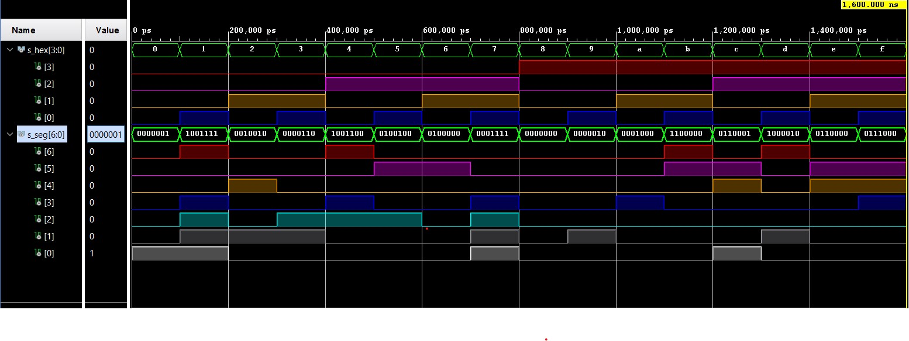
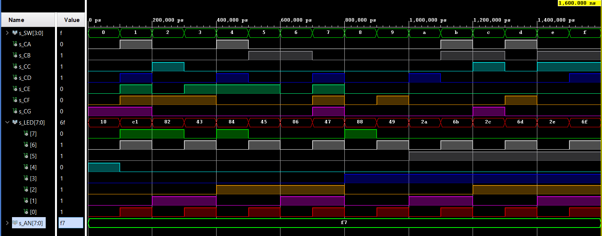

# Lab 04 segment

## 1) Preparation tasks

### Truth table

| **Hex** | **Inputs** | **A** | **B** | **C** | **D** | **E** | **F** | **G** |
| :-: | :-: | :-: | :-: | :-: | :-: | :-: | :-: | :-: |
| 0 | 0000 | 0 | 0 | 0 | 0 | 0 | 0 | 1 |
| 1 | 0001 | 1 | 0 | 0 | 1 | 1 | 1 | 1 |
| 2 | 0010 | 0 | 0 | 1 | 0 | 0 | 1 | 0 |
| 3 | 0011 | 0 | 0 | 0 | 0 | 1 | 1 | 0 |
| 4 | 0100 | 1 | 0 | 0 | 1 | 1 | 0 | 0 |
| 5 | 0101 | 0 | 1 | 0 | 0 | 1 | 0 | 0 |
| 6 | 0110 | 0 | 1 | 0 | 0 | 0 | 0 | 0 |
| 7 | 0111 | 0 | 0 | 0 | 1 | 1 | 1 | 1 |
| 8 | 1000 | 0 | 0 | 0 | 0 | 0 | 0 | 0 |
| 9 | 1001 | 0 | 0 | 0 | 0 | 0 | 1 | 0 |
| A | 1010 | 0 | 0 | 0 | 1 | 0 | 0 | 0 |
| b | 1011 | 1 | 1 | 0 | 0 | 0 | 0 | 0 |
| C | 1100 | 0 | 1 | 1 | 0 | 0 | 0 | 1 |
| d | 1101 | 1 | 0 | 0 | 0 | 0 | 1 | 0 |
| E | 1110 | 0 | 1 | 1 | 0 | 0 | 0 | 0 |
| F | 1111 | 0 | 1 | 1 | 1 | 0 | 0 | 0 |


### Decoder truth table


## 2) Seven-segment display decoder.

### VHDL architecture from source file hex_7seg.vhd

```vhdl
architecture Behavioral of hex_7seg is

begin

    p_7seg_decoder : process(hex_i)
    begin
        case hex_i is
            when "0000" =>
                seg_o <= "0000001";     -- 0
            
            when "0001" =>
                seg_o <= "1001111";     -- 1
            
            when "0010" =>
                seg_o <= "0010010";     -- 2
            
            when "0011" =>
                seg_o <= "0000110";     -- 3
            
            when "0100" =>
                seg_o <= "1001100";     -- 4
            
            when "0101" =>
                seg_o <= "0100100";     -- 5
            
            when "0110" =>
                seg_o <= "0100000";     -- 6
            
            when "0111" =>
                seg_o <= "0001111";     -- 7
            
            when "1000" =>
                seg_o <= "0000000";     -- 8
            
            when "1001" =>
                seg_o <= "0000010";     -- 9
            
            when "1010" =>
                seg_o <= "0001000";     -- A
            
            when "1011" =>
                seg_o <= "1100000";     -- b
            
            when "1100" =>
                seg_o <= "0110001";     -- C
            
            when "1101" =>
                seg_o <= "1000010";     -- d    
            
            when "1110" =>
                seg_o <= "0110000";     -- E
            
            when others =>
                seg_o <= "0111000";     -- F
        end case;
    end process p_7seg_decoder;


end Behavioral;

```

### VHDL stimulus process from testbench file tb_hex_7seg.vhd

```vhdl
p_stimulus : process
    begin
        report "Stimulus process started" severity note;
        
        s_hex <= "0000"; wait for 100 ns; --0
        
        s_hex <= "0001"; wait for 100 ns; --1
        
        s_hex <= "0010"; wait for 100 ns; --2
        
        s_hex <= "0011"; wait for 100 ns; --3
        
        s_hex <= "0100"; wait for 100 ns; --4
        
        s_hex <= "0101"; wait for 100 ns; --5
        
        s_hex <= "0110"; wait for 100 ns; --6
        
        s_hex <= "0111"; wait for 100 ns; --7
        
        s_hex <= "1000"; wait for 100 ns; --8
        
        s_hex <= "1001"; wait for 100 ns; --9
        
        s_hex <= "1010"; wait for 100 ns; --A
        
        s_hex <= "1011"; wait for 100 ns; --b
        
        s_hex <= "1100"; wait for 100 ns; --C
        
        s_hex <= "1101"; wait for 100 ns; --d
        
        s_hex <= "1110"; wait for 100 ns; --E
        
        s_hex <= "1111"; wait for 100 ns; --F
        
           
        report "Stimulus process finished" severity note;
    end process p_stimulus;

```


### Screenshot with simulated time waveforms with all inputs and outputs




### VHDL code from source file top.vhd

```vhdl
 port map(
            hex_i => SW,
            
            seg_o(6) => CA,
            seg_o(5) => CB,
            seg_o(4) => CC,
            seg_o(3) => CD,
            seg_o(2) => CE,
            seg_o(1) => CF,
            seg_o(0) => CG
        );
        
```


## 3) LED(7:4) indicators

### Truth table and VHDL code for LEDs(7:4)

| **Hex** | **Inputs** | **LED(7:4)** |
| :-: | :-: | :-: |
| 0 | 0000 | 4 |
| 1 | 0001 | 6,7 |
| 2 | 0010 | 7 |
| 3 | 0011 | 6 |
| 4 | 0100 | 7 |
| 5 | 0101 | 6 |
| 6 | 0110 | - |
| 7 | 0111 | 6 |
| 8 | 1000 | 7 |
| 9 | 1001 | 5,6 |
| A | 1010 | - |
| b | 1011 | 6 |
| C | 1100 | - |
| d | 1101 | 6 | 
| E | 1110 | - | 
| F | 1111 | 6 |

```vhdl
    -- Display input value
    LED(3 downto 0) <= SW;

    -- Turn LED(4) on if input value is equal to 0, ie "0000"
    -- WRITE YOUR CODE HERE
     LED(4)  <= '1' when (SW = "0000") else '0';
  
    -- Turn LED(5) on if input value is greater than "1001"
    -- WRITE YOUR CODE HERE
     LED(5)  <= '1' when (SW > "1001") else '0';
    
    -- Turn LED(6) on if input value is odd, ie 1, 3, 5, ...
    -- WRITE YOUR CODE HERE
    LED(6) <= '1' when (SW = "0001" or SW = "0011" or SW = "0101" or SW = "0111" or 
                        SW = "1001" or SW = "1011" or SW = "1101" or SW = "1111") else '0';
    
    -- Turn LED(7) on if input value is a power of two, ie 1, 2, 4, or 8
    -- WRITE YOUR CODE HERE
    LED(7)  <= '1' when (SW = "0001" or SW = "0010" or SW = "0100" or SW = "1000") else '0';
```


### Screenshot with simulated time waveforms with all inputs and outputs



