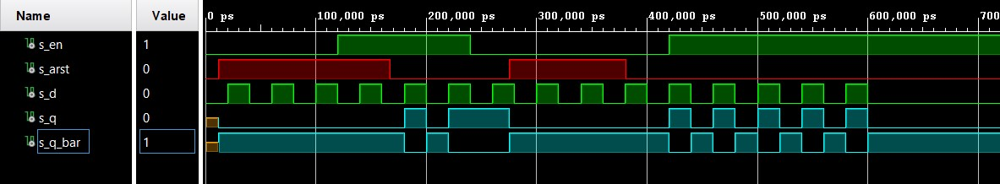
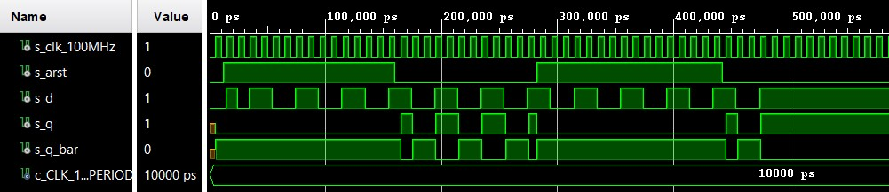
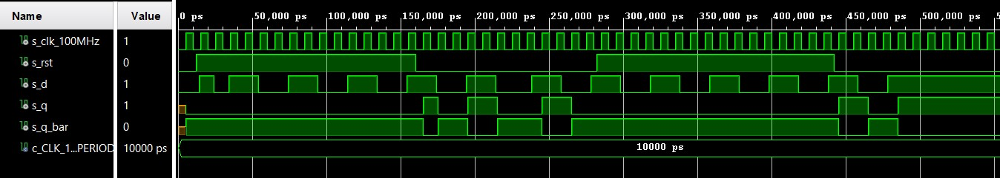
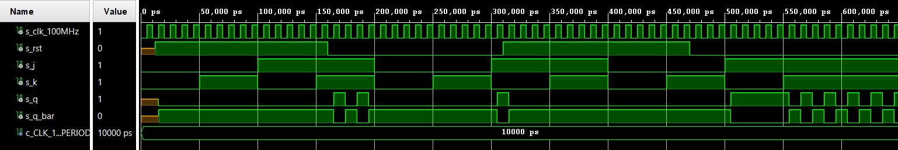
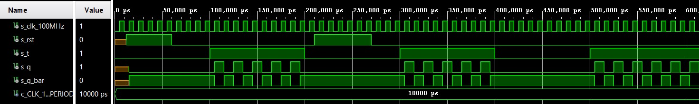

# Lab 7: Latches and Flip-flops
## 1) Preparation tasks
   Q(n+1) = d
   
   | **D** | **Qn** | **Q(n+1)** | **Comments** |
   | :-: | :-: | :-: | :-- |
   | 0 | 0 | 0 | No change |
   | 0 | 1 | 0 | Invert |
   | 1 | 0 | 1 | Invert |
   | 1 | 1 | 1 | No change |
   
   Q(n+1) = j * (not Qn) + (not k) * Qn
   
   | **J** | **K** | **Qn** | **Q(n+1)** | **Comments** |
   | :-: | :-: | :-: | :-: | :-- |
   | 0 | 0 | 0 | 0 | No change |
   | 0 | 0 | 1 | 1 | No change |
   | 0 | 1 | 0 | 0 | Reset |
   | 0 | 1 | 1 | 0 | Reset |
   | 1 | 0 | 0 | 1 | Set |
   | 1 | 0 | 1 | 1 | Set |
   | 1 | 1 | 0 | 1 | Toggle |
   | 1 | 1 | 1 | 0 | Toggle |
   
   Q(n+1) = t * (not Qn) + (not t) * Qn
   
   | **T** | **Qn** | **Q(n+1)** | **Comments** |
   | :-: | :-: | :-: | :-: |
   | 0 | 0 | 0 | No change |
   | 0 | 1 | 1 | No change |
   | 1 | 0 | 1 | Invert (Toggle) |
   | 1 | 1 | 0 | Invert (Toggle) |

## 2) D latch.
### VHDL code listing of the process p_d_latch
```vhdl
p_d_latch : process (d, arst, en)
    begin
        if (arst = '1') then
            q <= '0';
            q_bar <= '1';
       
        elsif (en = '1') then
            q <= d;
            q_bar <= not d;   
        
        end if; 
          
    end process p_d_latch;  
```
### VHDL reset and stimulus processes from the testbench tb_d_latch.vhd
```vhdl
p_reset_gen : process
    begin
        s_arst <= '0';
        wait for 12 ns;
        
        -- Reset activated
        s_arst <= '1';
        wait for 155 ns;
       
        
        s_arst <= '0';
        wait for 108 ns;
        
        -- Reset activated
        s_arst <= '1';
        wait for 106 ns;
       
        s_arst <= '0';
        wait;
    end process p_reset_gen;
    
    p_stimulus : process
    begin
        report "Stimulus process started" severity note;
            s_d <= '0';
            s_en <= '0';
            
            assert (s_q = '0')
            report "nesouhlasí" severity error;
            
            wait for 20ns;
            s_d <= '1';
            wait for 20ns;
            s_d <= '0';
            wait for 20ns;
            s_d <= '1';
            wait for 20ns;
            s_d <= '0';
            wait for 20ns;
            s_d <= '1';
            wait for 20ns;
            s_d <= '0';
            
            assert (s_q = '0' and s_q_bar = '1')
            report "nesouhlasí" severity error;
            
            s_en <= '1';

            wait for 20ns;
            s_d <= '1';
            wait for 20ns;
            s_d <= '0';
            wait for 20ns;
            s_d <= '1';
            wait for 20ns;
            s_d <= '0';
            wait for 20ns;
            s_d <= '1';
            wait for 20ns;
            s_d <= '0';
            
            s_en <= '0';
                        
            wait for 20ns;
            s_d <= '1';
            wait for 20ns;
            s_d <= '0';
            wait for 20ns;
            s_d <= '1';
            wait for 20ns;
            s_d <= '0';
            wait for 20ns;
            s_d <= '1';
            wait for 20ns;
            s_d <= '0';   
            
            s_en <= '1';
            
            wait for 20ns;
            s_d <= '1';
            wait for 20ns;
            s_d <= '0';
            wait for 20ns;
            s_d <= '1';
            wait for 20ns;
            s_d <= '0';
            wait for 20ns;
            s_d <= '1';
            wait for 20ns;
            s_d <= '0';
            wait for 20ns;
            s_d <= '1';
            wait for 20ns;
            s_d <= '0';
            wait for 20ns;
            s_d <= '1';
            wait for 20ns;
            s_d <= '0';
            wait for 20ns;
            s_d <= '1';
            wait for 20ns;
            s_d <= '0';
    
    report "Stimulus process finished" severity note;
        wait;
    end process p_stimulus;
```


## 3) Flip-flops
### VHDL code listing of the processes
d_ff_arst.vhd
```vhdl
p_d_latch : process (arst, clk)
    begin
        if (arst = '1') then
            q <= '0';
            q_bar <= '1';
       
        elsif rising_edge(clk) then
            q <= d;
            q_bar <= not d;   
        
        end if; 
          
    end process p_d_latch;
```
d_ff_rst.vhd
```vhdl
p_d_ff_rst : process (clk)
    begin
        if rising_edge(clk) then
           
            if (rst = '1')then
                q <= '0';
                q_bar <= '1';
            else
                q <= d;
                q_bar <= not d;
                
            end if;
             
        end if; 
    end process p_d_ff_rst;
```
jk_ff_rst.vhd
```vhdl
p_jk_ff_rst : process (clk)
    begin
        if rising_edge(clk) then
           
            if (rst = '1')then
                s_q <= '0';
            
            else
                
                if (j = '0' and k = '0')then
                    s_q <= s_q;
               
                elsif (j = '0' and k = '1')then  
                    s_q <= '0';
              
                elsif (j = '1' and k = '0')then 
                    s_q <= '1';
              
                elsif (j = '1' and k = '1')then  
                    s_q <= not s_q;                 
                
                end if;
             
            end if;
             
        end if; 
          
    end process p_jk_ff_rst;
```
t_ff_rst.vhd
```vhdl
p_t_ff_rst : process (clk)
    begin
        if rising_edge(clk) then
           
            if (rst = '1')then
                s_q <= '0';
            
            else
                
                if (t = '0')then
                    s_q <= s_q;
               
                elsif (t = '1')then  
                    s_q <= not s_q;                 
                
                end if;
             
            end if;
             
        end if; 
          
    end process p_t_ff_rst; 
```
### VHDL clock, reset and stimulus processes from the testbench files
tb_d_ff_arst.vhd
```vhdl
p_clk_gen : process
    begin
        while now < 750 ns loop         -- 75 periods of 100MHz clock
            s_clk_100MHz <= '0';
            wait for c_CLK_100MHZ_PERIOD / 2;
            s_clk_100MHz <= '1';
            wait for c_CLK_100MHZ_PERIOD / 2;
        end loop;
        wait;
    end process p_clk_gen;

    p_reset_gen : process
    begin
        s_arst <= '0';
        wait for 12 ns;
        
        -- Reset activated
        s_arst <= '1';
        wait for 148 ns;
       
        
        s_arst <= '0';
        wait for 138 ns;
        
        -- Reset activated
        s_arst <= '1';
        wait for 160 ns;
       
        s_arst <= '0';
        wait;
    end process p_reset_gen;
    p_stimulus : process
    begin
        report "Stimulus process started" severity note;
            s_d <= '0';
            
            wait for 14ns;
            s_d <= '1';
            wait for 10ns;
            s_d <= '0';
            
            wait for 6ns;
            s_d <= '0';
            
            assert (s_q = '0' and s_q_bar = '1')
            report "nesouhlasí" severity error;
            
            wait for 4ns;
            s_d <= '1';
            wait for 20ns;
            s_d <= '0';
            wait for 20ns;
            s_d <= '1';
            wait for 20ns;
            s_d <= '0';
            wait for 20ns;
            s_d <= '1';
            wait for 20ns;
            s_d <= '0';
            wait for 20ns;
            s_d <= '1';
            wait for 20ns;
            s_d <= '0';
            wait for 20ns;
            s_d <= '1';
            wait for 20ns;
            s_d <= '0';
            wait for 20ns;
            s_d <= '1';
            wait for 20ns;
            s_d <= '0';
            wait for 20ns;
            s_d <= '1';
            wait for 20ns;
            s_d <= '0';
            wait for 20ns;
            s_d <= '1';
            wait for 20ns;
            s_d <= '0';
            wait for 20ns;
            s_d <= '1';
            wait for 20ns;
            s_d <= '0';
            wait for 20ns;
            s_d <= '1';
            wait for 20ns;
            s_d <= '0';
            wait for 20ns;
            s_d <= '1';
            wait for 20ns;
            s_d <= '0';
            wait for 20ns;
            s_d <= '1'; 
    
    report "Stimulus process finished" severity note;
        wait;
    end process p_stimulus;
```
tb_d_ff_rst.vhd
```vhdl
p_clk_gen : process
    begin
        while now < 750 ns loop         -- 75 periods of 100MHz clock
            s_clk_100MHz <= '0';
            wait for c_CLK_100MHZ_PERIOD / 2;
            s_clk_100MHz <= '1';
            wait for c_CLK_100MHZ_PERIOD / 2;
        end loop;
        wait;
    end process p_clk_gen;

    p_reset_gen : process
    begin
        s_rst <= '0';
        wait for 12 ns;
        
        -- Reset activated
        s_rst <= '1';
        wait for 148 ns;
       
        
        s_rst <= '0';
        wait for 122 ns;
        
        -- Reset activated
        s_rst <= '1';
        wait for 160 ns;
       
        s_rst <= '0';
        wait;
    end process p_reset_gen;
    p_stimulus : process
    begin
        report "Stimulus process started" severity note;
            s_d <= '0';
           
            wait for 14ns;
            s_d <= '1';
            wait for 10ns;
            s_d <= '0';
            
            wait for 6ns;
            s_d <= '0';
            
            assert (s_q = '0' and s_q_bar = '1')
            report "nesouhlasí" severity error;
            
            wait for 4ns;
            s_d <= '1';
            wait for 20ns;
            s_d <= '0';
            wait for 20ns;
            s_d <= '1';
            wait for 20ns;
            s_d <= '0';
            wait for 20ns;
            s_d <= '1';
            wait for 20ns;
            s_d <= '0';
            wait for 20ns;
            s_d <= '1';
            wait for 20ns;
            s_d <= '0';
            wait for 20ns;
            s_d <= '1';
            wait for 20ns;
            s_d <= '0';
            wait for 24ns;
            s_d <= '1';
            wait for 20ns;
            s_d <= '0';
            wait for 20ns;
            s_d <= '1';
            wait for 20ns;
            s_d <= '0';
            wait for 20ns;
            s_d <= '1';
            wait for 20ns;
            s_d <= '0';
            wait for 20ns;
            s_d <= '1';
            wait for 20ns;
            s_d <= '0';
            wait for 20ns;
            s_d <= '1';
            wait for 20ns;
            s_d <= '0';
            wait for 20ns;
            s_d <= '1';
            wait for 20ns;
            s_d <= '0';
            wait for 20ns;
            s_d <= '1'; 
    
    report "Stimulus process finished" severity note;
        wait;
    end process p_stimulus;
```
tb_jk_ff_rst.vhd
```vhdl
p_clk_gen : process
        begin
            while now < 750 ns loop         -- 75 periods of 100MHz clock
                s_clk_100MHz <= '0';
                wait for c_CLK_100MHZ_PERIOD / 2;
                s_clk_100MHz <= '1';
                wait for c_CLK_100MHZ_PERIOD / 2;
            end loop;
            wait;
    end process p_clk_gen;

    p_reset_gen : process
        begin
            wait for 12 ns;
        
            -- Reset activated
            s_rst <= '1';
            wait for 148 ns;
       
            s_rst <= '0';
            wait for 150 ns;
        
        -- Reset activated
            s_rst <= '1';
            wait for 160 ns;
       
            s_rst <= '0';
            wait;
    end process p_reset_gen;
        
    p_stimulus : process
        begin
            report "Stimulus process started" severity note;
                s_j <= '0';
                s_k <= '0';
            
            
                wait for 50ns;
                s_j <= '0';
                s_k <= '1';
                wait for 50ns;
                s_j <= '1';
                s_k <= '0';
                wait for 50ns;
                s_j <= '1';
                s_k <= '1';
                wait for 50ns;
                s_j <= '0';
                s_k <= '0';
            
            
                wait for 50ns;
                s_j <= '0';
                s_k <= '1';
                wait for 50ns;
                s_j <= '1';
                s_k <= '0';
                wait for 50ns;
                s_j <= '1';
                s_k <= '1';
                wait for 50ns;
                s_j <= '0';
                s_k <= '0';
            
            
                wait for 50ns;
                s_j <= '0';
                s_k <= '1';
                wait for 50ns;
                s_j <= '1';
                s_k <= '0';
                wait for 50ns;
                s_j <= '1';
                s_k <= '1';
                wait for 50ns;
    
        report "Stimulus process finished" severity note;
            wait;
    end process p_stimulus;
```
tb_t_ff_rst.vhd
```vhdl
p_clk_gen : process
        begin
            while now < 750 ns loop         -- 75 periods of 100MHz clock
                s_clk_100MHz <= '0';
                wait for c_CLK_100MHZ_PERIOD / 2;
                s_clk_100MHz <= '1';
                wait for c_CLK_100MHZ_PERIOD / 2;
            end loop;
            wait;
    end process p_clk_gen;

    p_reset_gen : process
        begin
            wait for 12 ns;
        
            -- Reset activated
            s_rst <= '1';
            wait for 48 ns;
       
            s_rst <= '0';
            wait for 150 ns;
        
        -- Reset activated
            s_rst <= '1';
            wait for 60 ns;
       
            s_rst <= '0';
            wait;
    end process p_reset_gen;
        
    p_stimulus : process
        begin
            report "Stimulus process started" severity note;
                s_t <= '0';
                
                wait for 50ns;
                s_t <= '0';
                wait for 50ns;
                s_t <= '1';
                wait for 50ns;
                s_t <= '1';
                wait for 50ns;
                s_t <= '0';
                        
                wait for 50ns;
                s_t <= '0';
                wait for 50ns;
                s_t <= '1';
                wait for 50ns;
                s_t <= '1';
                wait for 50ns;
                s_t <= '0';
            
                wait for 50ns;
                s_t <= '0';
                wait for 50ns;
                s_t <= '1';
                wait for 50ns;
                s_t <= '1';
                wait for 50ns;
    
        report "Stimulus process finished" severity note;
            wait;
    end process p_stimulus;
```
### Screenshot with simulated time waveforms






## 4) Shift register
