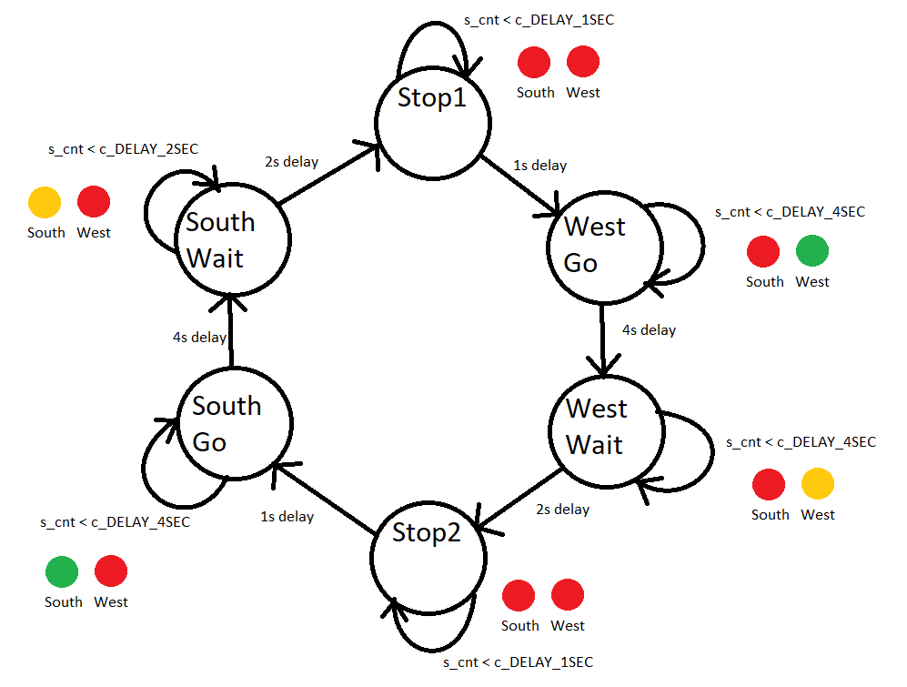

# Lab 8: Traffic light controller
## 1) Preparation tasks
### Completed state table
| **Input P** | `0` | `0` | `1` | `1` | `0` | `1` | `0` | `1` | `1` | `1` | `1` | `0` | `0` | `1` | `1` | `1` |
| :-: | :-: | :-: | :-: | :-: | :-: | :-: | :-: | :-: | :-: | :-: | :-: | :-: | :-: | :-: | :-: | :-: |
| **State** | A | A | B | C | C | D | A | B | C | D | B | B | B | C | D | B |
| **Output R** | `0` | `0` | `0` | `0` | `0` | `1` | `0` | `0` | `0` | `1` | `0` | `0` | `0` | `0` | `1` | `0` |

### Connection of RGB LEDs on Nexys A7 board and completed table

| **RGB LED** | **Artix-7 pin names** | **Red** | **Yellow** | **Green** |
| :-: | :-: | :-: | :-: | :-: |
| LD16 | N15, M16, R12 | `1,0,0` | `1,1,0` | `0,1,0` |
| LD17 | N16, R11, G14 | `1,0,0` | `1,1,0` | `0,1,0` |

## 2) Traffic light controller
### State diagram

### VHDL code of sequential process p_traffic_fsm

### VHDL code of combinatorial process p_output_fsm

### Screenshot(s) of the simulation

## 3) Smart controller
### State table

### State diagram

### VHDL code of sequential process p_smart_traffic_fsm

