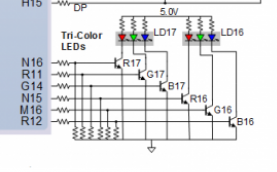
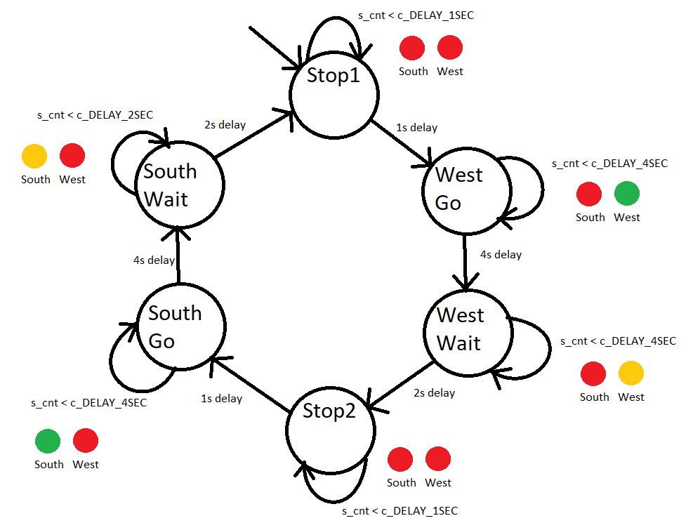
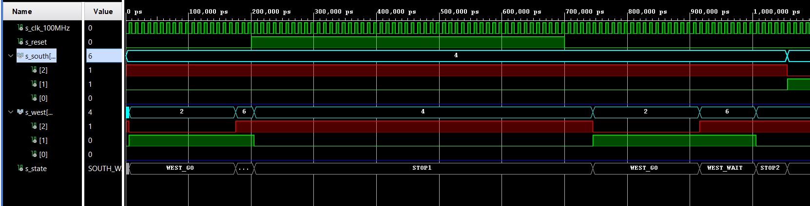
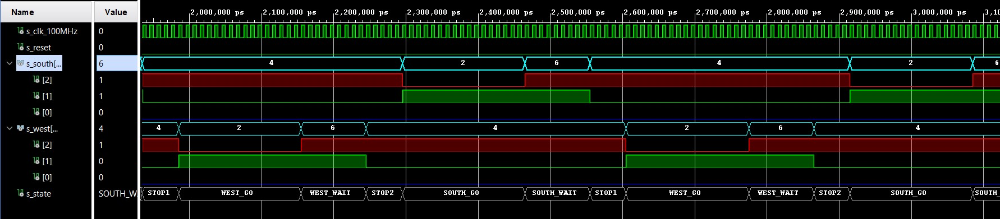
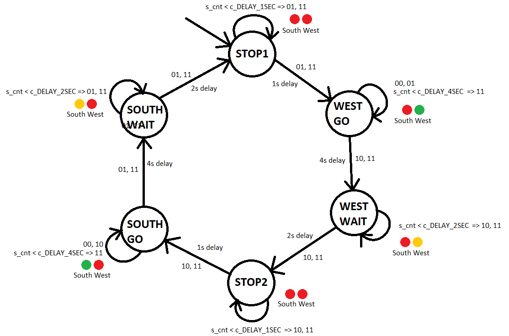

# Lab 8: Traffic light controller
## 1) Preparation tasks
### Completed state table
| **Input P** | `0` | `0` | `1` | `1` | `0` | `1` | `0` | `1` | `1` | `1` | `1` | `0` | `0` | `1` | `1` | `1` |
| :-: | :-: | :-: | :-: | :-: | :-: | :-: | :-: | :-: | :-: | :-: | :-:| :-: | :-: | :-: | :-: | :-: |
| **State** | A | A | B | C | C | D | A | B | C | D | B | B | B | C | D | B |
| **Output R** | `0` | `0` | `0` | `0` | `0` | `1` | `0` | `0` | `0` | `1` | `0` | `0` | `0` | `0` | `1` | `0` |

### Connection of RGB LEDs on Nexys A7 board and completed table


| **RGB LED** | **Artix-7 pin names** | **Red** | **Yellow** | **Green** |
| :-: | :-: | :-: | :-: | :-: |
| LD16 | N15, M16, R12 | `1,0,0` | `1,1,0` | `0,1,0` |
| LD17 | N16, R11, G14 | `1,0,0` | `1,1,0` | `0,1,0` |

## 2) Traffic light controller
### State diagram

### VHDL code of sequential process p_traffic_fsm
```vhdl
p_traffic_fsm : process(clk)
    begin
        if rising_edge(clk) then
            if (reset = '1') then       -- Synchronous reset
                s_state <= STOP1 ;      -- Set initial state
                s_cnt   <= c_ZERO;      -- Clear all bits

            elsif (s_en = '1') then
                
                case s_state is

                    when STOP1 =>
                        if (s_cnt < c_DELAY_1SEC) then
                            s_cnt <= s_cnt + 1;
                        else
                            s_state <= WEST_GO;
                            
                            s_cnt   <= c_ZERO;
                        end if;

                    when WEST_GO =>
                        if (s_cnt < c_DELAY_4SEC) then
                            s_cnt <= s_cnt + 1;
                        else
                            s_state <= WEST_WAIT;
                            
                            s_cnt   <= c_ZERO;
                        end if;
                   
                    when WEST_WAIT =>
                        if (s_cnt < c_DELAY_2SEC) then
                            s_cnt <= s_cnt + 1;
                        else
                            s_state <= STOP2;
                            
                            s_cnt   <= c_ZERO;
                        end if;
                    
                    when STOP2 =>
                        if (s_cnt < c_DELAY_1SEC) then
                            s_cnt <= s_cnt + 1;
                        else
                            s_state <= SOUTH_GO;
                            
                            s_cnt   <= c_ZERO;
                        end if;

                    when SOUTH_GO =>
                        if (s_cnt < c_DELAY_4SEC) then
                            s_cnt <= s_cnt + 1;
                        else
                            s_state <= SOUTH_WAIT;
                            
                            s_cnt   <= c_ZERO;
                        end if;
                   
                    when SOUTH_WAIT =>
                        if (s_cnt < c_DELAY_2SEC) then
                            s_cnt <= s_cnt + 1;
                        else
                            s_state <= STOP1;
                            
                            s_cnt   <= c_ZERO;
                        end if;
                    
                    when others =>
                        s_state <= STOP1;

                end case;
            end if; -- Synchronous reset
        end if; -- Rising edge
    end process p_traffic_fsm;
```
### VHDL code of combinatorial process p_output_fsm
```vhdl
p_output_fsm : process(s_state)
    begin
        case s_state is
            when STOP1 =>
                south_o <= "100";   -- Red (RGB = 100)
                west_o  <= "100";   -- Red (RGB = 100)
            
            when WEST_GO =>
                south_o <= "100";   -- Red (RGB = 100)
                west_o  <= "010";   -- Green (RGB = 010)
           
            when WEST_WAIT =>
                south_o <= "100";   -- Red (RGB = 100)
                west_o  <= "110";   -- Yellow (RGB = 110)
            
            when STOP2 =>
                south_o <= "100";   -- Red (RGB = 100)
                west_o  <= "100";   -- Red (RGB = 100)
            
            when SOUTH_GO =>
                south_o <= "010";   -- Green (RGB = 010)
                west_o  <= "100";   -- Red (RGB = 100)
            
            when SOUTH_WAIT =>
                south_o <= "110";   -- Yellow (RGB = 110)
                west_o  <= "100";   -- Red (RGB = 100)

            when others =>
                south_o <= "100";   -- Red
                west_o  <= "100";   -- Red
        end case;
    end process p_output_fsm;
```
### Screenshot(s) of the simulation



## 3) Smart controller
### State table
| **Current state (00)** | **Direction South** | **Direction West** |
| :-- | :-: | :-: |
| `SOUTH_GO`   | green  | red |
| `WEST_GO`   | red | green |

| **Current state (01)** | **Direction South** | **Direction West** | **Delay** |
| :-- | :-: | :-: | :-: |
| `SOUTH_GO`    | green | red | 0 sec |
| `SOUTH_WAIT`  | yellow | red | 2 sec |
| `STOP1`      | red | red | 1 sec |
| `WEST_GO`   | red | green |  |

| **Current state (10)** | **Direction South** | **Direction West** | **Delay** |
| :-- | :-: | :-: | :-: |
| `WEST_GO`    | red    | green | 0 sec |
| `WEST_WAIT`  | red    | yellow | 2 sec |
| `STOP2`      | red    | red | 1 sec |
| `SOUTH_GO`   | green  | red |  |

| **Current state (11)** | **Direction South** | **Direction West** | **Delay** |
| :-: | :-: | :-: | :-: |
| `STOP1`      | red    | red | 1 sec |
| `WEST_GO`    | red    | green | 4 sec |
| `WEST_WAIT`  | red    | yellow | 2 sec |
| `STOP2`      | red    | red | 1 sec |
| `SOUTH_GO`   | green  | red | 4 sec |
| `SOUTH_WAIT` | yellow | red | 2 sec |
### State diagram

### VHDL code of sequential process p_smart_traffic_fsm
```vhdl
 p_smart_traffic_fsm : process(clk)
    begin
        if rising_edge(clk) then
            if (reset = '1') then       -- Synchronous reset
                s_state <= STOP1 ;      -- Set initial state
                s_cnt   <= c_ZERO;      -- Clear all bits

            elsif (s_en = '1') then
                
                case s_state is

                    when STOP1 =>
                        
                        if (s_cnt < c_DELAY_1SEC) then
                            s_cnt <= s_cnt + 1;
                        else
                            s_state <= WEST_GO;
                            
                            s_cnt   <= c_ZERO;
                        end if;

                    when WEST_GO =>
                        if (car_south = '0' and car_west = '0') then
                            s_state <= WEST_GO;
                        
                        elsif (car_south = '0' and car_west = '1') then
                            s_state <= WEST_GO;
                        
                        elsif (car_south = '1' and car_west = '0') then
                            s_state <= WEST_WAIT;
                                
                            s_cnt   <= c_ZERO;
                        
                        elsif (car_south = '1' and car_west = '1') then
                            if (s_cnt < c_DELAY_4SEC) then
                                s_cnt <= s_cnt + 1;
                            else
                                s_state <= WEST_WAIT;
                                
                                s_cnt   <= c_ZERO;
                            end if;
                        end if; 
                   
                    when WEST_WAIT =>
                        if (s_cnt < c_DELAY_2SEC) then
                            s_cnt <= s_cnt + 1;
                        else
                            s_state <= STOP2;
                                
                            s_cnt   <= c_ZERO;
                        end if;
                                                
                    when STOP2 =>
                        if (s_cnt < c_DELAY_1SEC) then
                            s_cnt <= s_cnt + 1;
                        else
                            s_state <= SOUTH_GO;
                            
                            s_cnt   <= c_ZERO;
                        end if;

                    when SOUTH_GO =>
                        if (car_south = '0' and car_west = '0') then
                            s_state <= SOUTH_GO;
                        
                        elsif (car_south = '1' and car_west = '0') then
                            s_state <= SOUTH_GO;
                        
                        elsif (car_south = '0' and car_west = '1') then
                            s_state <= SOUTH_WAIT;
                                
                            s_cnt   <= c_ZERO;
                        
                        elsif (car_south = '1' and car_west = '1') then
                            if (s_cnt < c_DELAY_4SEC) then
                                s_cnt <= s_cnt + 1;
                            else
                                s_state <= SOUTH_WAIT;
                                
                                s_cnt   <= c_ZERO;
                            end if;
                        end if; 
                   
                    when SOUTH_WAIT =>
                        if (s_cnt < c_DELAY_2SEC) then
                            s_cnt <= s_cnt + 1;
                        else
                            s_state <= STOP1;
                            
                            s_cnt   <= c_ZERO;
                        end if;
                    
                     
                    when others =>
                        s_state <= STOP1;

                end case;
            end if; -- Synchronous reset
        end if; -- Rising edge
    end process p_smart_traffic_fsm;
```


